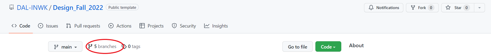
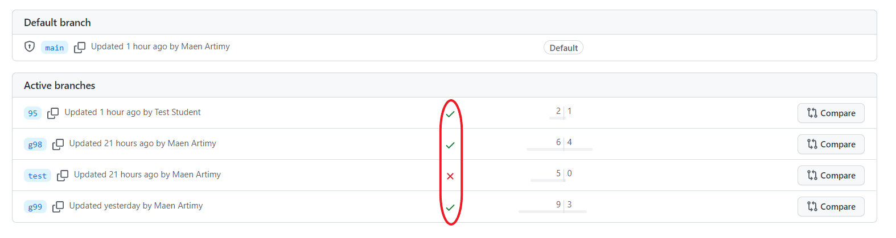
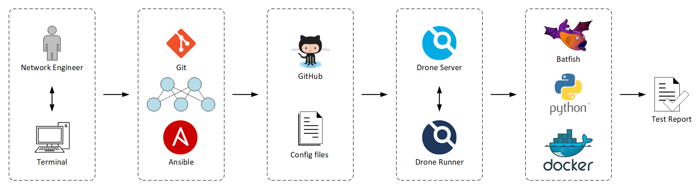

# Automated Network Validation

This repository provides an automated process to checking the validity of network configuration files generated during lab sessions.

To use this repository, each student group need to:

1. Select one student to carry out the remaining tasks
2. Clone the main branch of this repository
3. Create a branch named after their group
4. Copy network device configuration to the branch
5. Commit and push the branch
6. Check if their configuration files have passed the tests

Instructors and students need a GitHub account to be able to push lab configuration and view results. To eliminate redundant work, only one student from each lab group is needed to follow the steps below.

Instructors will also be able to view the results and advise students on how to fix any errors.

## Instructions for Students:

Follow these instructions after completing all lab configuration steps:

1. Clone the main branch of this repository in the lab's VM home directory:
   ```
   $ cd
   $ git clone --branch main https://github.com/martimy/Network_Design
   ```
2. Create a branch named after your lab and group numbers (use the format labX_gYY, where X is the lab number and YY is your group number) and checkout the branch:
   ```
   $ cd Network_Design
   $ git checkout -b lab1_g99
   ```
3. Copy network device configuration using Ansible:
   ```
   $ export ANSIBLE_HOST_KEY_CHECKING=False
   $ ansible-playbook -i inventory.txt play_backup.yml
   ```
   If the above process was successful (all routers report ok=1), then you will find a folder 'lab/configs' created in the repository. If the process failed, then it is likely that the SSH configuration on the network devices is not completed and you must follow the instructions in the lab assignment documents to configure SSH.
4. Commit the changes and push the branch:
   *Note: you will need a Github account to complete this step. You also need to be added as a collaborator the repository by the course instructor. When asked for username/password, enter your GitHub username and your token (instead of password). You can obtain an access token by following the instructions in this [link](https://docs.github.com/en/authentication/keeping-your-account-and-data-secure/creating-a-personal-access-token).*

   ```
   $ git add lab
   $ git status
    On branch lab1_g99
    Changes to be committed:
      (use "git reset HEAD <file>..." to unstage)

            new file:   lab/configs/R11.cfg
            new file:   lab/configs/R12.cfg
            new file:   lab/configs/R21.cfg
            new file:   lab/configs/R22.cfg
            new file:   lab/configs/R23.cfg
   $ git commit -m "add config files for group g99"
   $ git push --set-upstream origin lab1_g99
   ```
5. Check if your configuration files have passed the checks:
   - Go the github [repository](https://github.com/martimy/Network_Design)
   - click on 'barnches'   

   

   - Verify that you have a green checkmark in front of your branch. You can click on the checkmark to find details.

   


## Validation Tests

There are two categories of validation tests performed on the lab configuration:

### Parsing tests

Parsing tests are performed using simple parsing of configuration files to confirm the presence of specific lines of configuration. The tests are performed on all labs and they include:

- SNMP configuration check: Confirms the presence of SNMP community strings, location, and contact lines.
- SysLog configuration check: Confirms the presence of SysLog server line.
- Clock configuration check: Confirms the present of time zone settings.

The parsing test fail if any of these individual tests fail.


### Configuration tests

Batfish is a network configuration analysis tool that guarantees validity and correctness of a network's configuration by building a model of the network's behavior based on device configurations.

Batfish is used to perform simple tests on lab configuration files. These tests differ depending on the lab assignment.

**Labs 1 to 4 tests:**

- Number of Routers: Check of there are five configuration files and each file represents a unique router (no duplicates)
- Valid Configuration: Ensures that Batfish is able to recognize the vendor's configuration files.   
- Clean Parsing: Checks if there are certain configuration lines that Batfish cannot understand or ignores.
- Host Properties: Tests if the router's name, the domain name and NTP servers are configured as expected.
- Undefined References: Tests if there are structures (such as ACL) that are used in the configuration but not defined.
- Shut Interfaces: Tests if all unused interfaces are shutdown.

Labs 1-4 configuring test fails if any of the above tests fail except the configuration and parsing tests. The test continues even if some configuration lines are not understood by Batfish.

**Lab 5 tests:**

Lab 5 checks include all previous checks and three more:

- Duplicate Router IDs: Checks there are no duplicate BGP router IDs.
- BGP Compatibility: Checks that there are no incompatible BGP sessions present in the configuration.
- BGP Unestablished: Checks if there BGP sessions that are compatible but not established.

Lab 5 configuration test fails if any of the above tests fail.


## Validation Process

This network validation process applies some CI/CD principles to check device configuration against some common configuration errors. The pipeline includes the following components:



- [Ansible](https://www.ansible.com/) — Network automation tool (based on Python):  
  Ansible is used to automate the configuration of network devices as well at retrieve the configuration files in preparation for the configuration check.
- [Batfish](https://www.batfish.org/) — Network configuration analysis tool (based in Python):  
  Batfish performs vendor-independent validation of network configuration by answering several questions and comparing answers with expected results.   
- [Docker](https://www.docker.com/) — Platform for building, deploying, and managing containerized applications:  
  Docker runs several containers in the pipeline, including: Drone Server, Drone Runner, Batfish, and martimy/netauto.
- [Drone](https://www.drone.io/) — Continuous integration platform:  
  A Drone server manages the pipelines while one or more Drone runners poll the server for workloads to execute. The pipeline execution is triggered when a network configuration is pushed to the GitHub repository.
- [Git](https://git-scm.com/) — Revision control system:  
  Git tracks network configuration changes and pulls/pushes the configuration to a GitHub repository.
- [GitHub](https://github.com/) — Cloud-based Git repository:  
  Hosts all test scripts, Ansible scripts, and Drone configuration file. GitHub is also used to push network configuration files to trigger the checking pipeline.
- [martimy/netauto](https://hub.docker.com/r/martimy/netauto) — Docker image:  
  This is Python container that includes all modules needed to run the test scripts.
- [Python](https://www.python.org/) — Programming language for network applications:  
  All test software is written in Python, including scripts that run tests that are not available in Batfish.


## Software Installation

### Server installation

Docker, Drone server and runner(s) need to be installed on a publicly accessible server (hosted locally or in the Cloud). The installation steps are as follows (for Ubuntu Linux):

1. At GitHub, go to (Settings -> Developer Settings -> OAuth Apps) and add Drone information to OAuth Apps. Record Client ID and Client Secret.

2. Install Docker using the convenience-script (find other methods of installations [here](https://docs.docker.com/engine/install/ubuntu/).):

    ```
     $ curl -fsSL https://get.docker.com -o get-docker.sh
     $ sudo sh get-docker.sh
    ```

3. Generate a shared secret between the Drone server and runners:

   ```
   $ openssl rand -hex 16
   ```

4. Install Drone Server, and Drone Runner:

   ```
   $ docker pull drone/drone:2
   $ docker pull drone/drone-runner-docker:1
   ```

5. At the Drone server host, edit the start_drone.sh script to include the following information:
       - Client ID and Secret (from step 1)
       - Runner secret (from step 3)
       - Host IP address
       - Admin username (optional)

   also, edit the start_runner.sh script to include:
       - Runner secret
       - Host IP address

6. Execute the script start_drone.sh and start_runner.sh

    ```
    $ ./start_drone
    $ ./start_runner
    ```  
7. Direct your web browser to the server IP address. Log into the Drone server and activate the required repository (this one, for example).
8. In the repository Setting, add any secrets needed in your test scripts (e.g. Batfish server location)

### Pipeline installation and configuration

This part requires the installation for Batfish's Docker image and configuring the CI/CD pipeline.

\<to be completed\>

## Acknowledgments

The development of this pipeline follows the examples and the tutorials included in:

[1] JulioPDX. "Building a Network CI/CD Pipeline Part 1," https://juliopdx.com/2021/10/20/building-a-network-ci/cd-pipeline-part-1/  
[2] Packet Coders. https://www.packetcoders.io/tag/blog/
